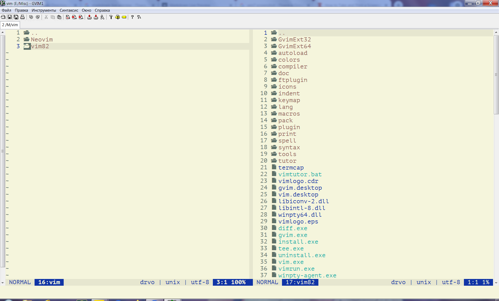

### Description

Drvo is a directory viewer for Vim originally inspired by
[Dirvish](https://github.com/justinmk/vim-dirvish).

### Installation

Using [minpac](https://github.com/k-takata/minpac):

```vim
call minpac#init()
call minpac#add('matveyt/vim-drvo')
```

### Usage

Type `:e.` to browse current directory. Also make sure to read `:help drvo`.

### Screenshot


